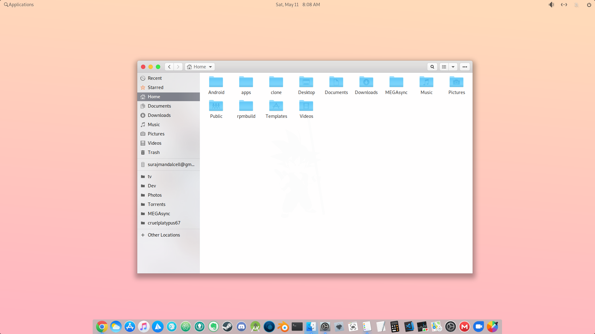
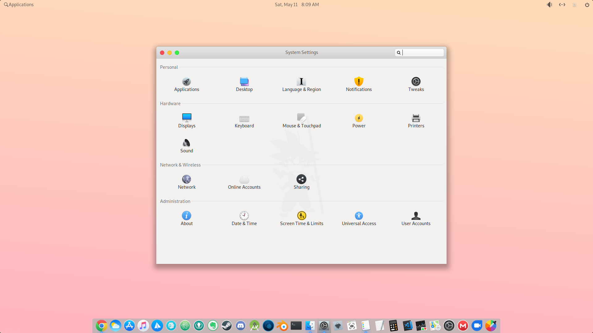
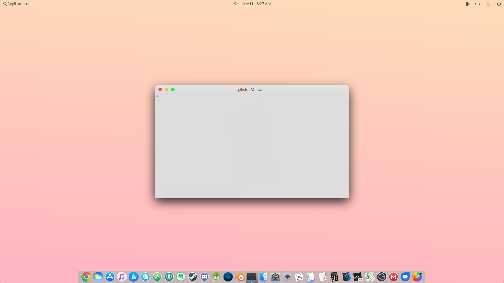
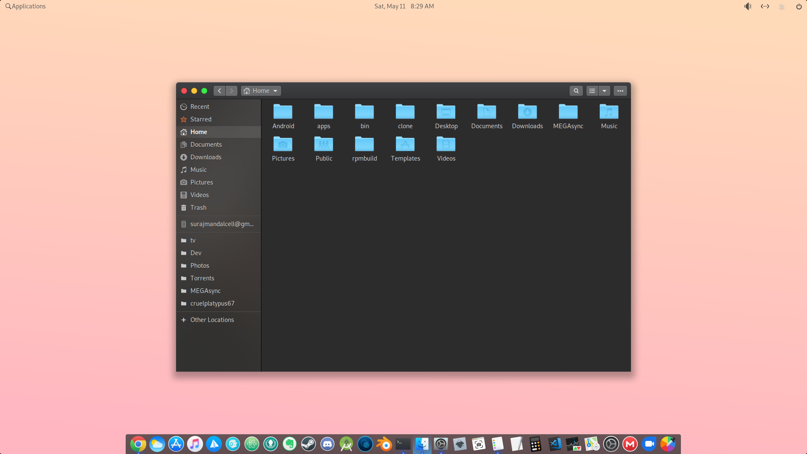
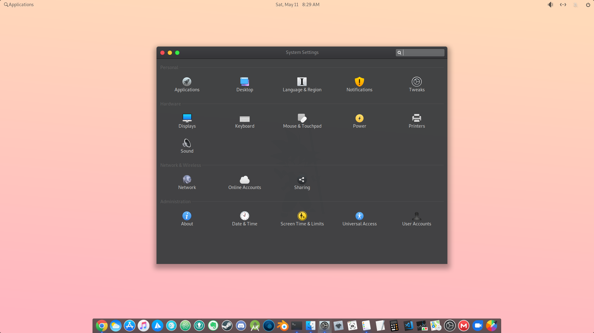
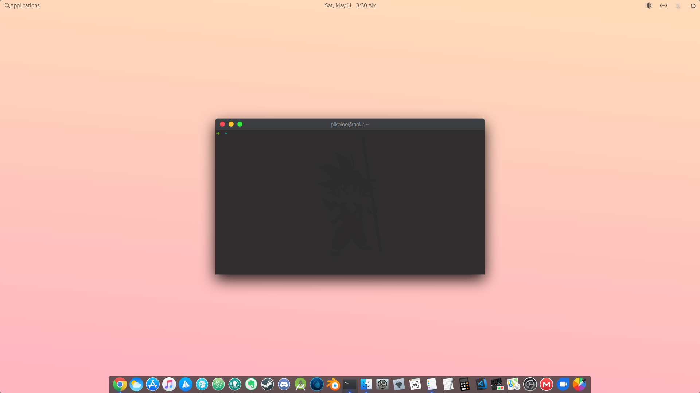

# Slate Theme

This is a modded version of the original mac os theme by PAULXFCE with added tweaks for elementary os and gnome apps in general.
This is in progress and for now it is much the same as the original theme by PAULXFCE.

Icon theme used : [elementary remiX](https://github.com/surajmandalcell/elementary-remiX)
Use this icon theme if you find big ugly wingpanel icons with other icon theme as this one uses default icon pack as base

##### Some screenshots  

Light version  

  
  
   

Dark version  

  
  

Link to original themes :  
https://github.com/paullinuxthemer/Mc-OS-themes  
https://github.com/surajmandalcell/elementary-x  
https://github.com/elementary/stylesheet  
